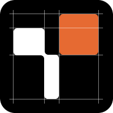

<p align="center">
  
</p>

<h1 align="center">Token-Aware-Image</h1>

One pain point in AI image generation is the last mile of pixel adjustment. Token-Image is a skill trying to bridge that gap.

Instead of generating a flat image, Token-Image writes React components backed by a design token system. Every color, font, spacing value, and radius is a token — tweak one number and every image in the set updates. The visual editor gives you a live browser preview to dial things in before rendering to PNG.

```
Prompt → AI agents write React components → Token-controlled design → PNG via Playwright
```

<!-- TODO: Add screenshot of the visual editor here -->
<!--  -->

## Installation

### Coding agent skill (any agent)

```bash
npx skills install https://github.com/czl9707/token-aware-image   
```

Then point it at this repository. Works with Claude Code, opencode, and any agent that supports the skills format.

### Claude Code Marketplace

``` bash
/plugin marketplace add czl9707/token-aware-image
/plugin install token-image
```

## Quick Start

1. Image Generation

```bash
/token-image create 3 images for me for <topic>.
```
  
  Agent will ask for theme, conents, layout, branding information.

2. Finetune design tokens.

``` bash
Launch the token editor please.
```

3. Render Images

``` bash
Render them please.
```

## The Token System

Every visual property is a token — a named value in a JSON file. Change `color.accent` from red to blue and every image in the set updates instantly. No re-prompting, no re-generating.

A token file looks like this:

```js
{
  "color": {
    "bg": "#0A0A1A",
    "surface": "rgba(255,255,255,0.08)",
    // ...
  },
  "fontFamily": {
    "display": "Outfit",
    "body": "Work Sans",
    "mono": "JetBrains Mono"
  },
  "fontSize": {
    "hero": 72,
    "h1": 48,
    // ...
  },
  "fontWeight": {
    "normal": 400,
    "bold": 700
  },
  "lineHeight": {
    "tight": 1.0,
    "normal": 1.5
  },
  "letterSpacing": {
    "tight": -0.03,
    "normal": 0,
    "wide": 0.08
  },
  "spacing": {
    "xs": 4,
    "sm": 8,
    // ...
  },
  "radius": {
    "sm": 8,
    "md": 16,
    "lg": 24
  },
  "opacity": {
    "muted": 0.6,
    "subtle": 0.4
  }
}

```

Tokens cover color, font families, sizes, weights, line heights, letter spacing, spacing, border radius, and opacity. There are 13 built-in presets, or you can create your own.

## Companion CLI — `@zane-chen/token-image`

A standalone CLI for rendering and visually editing your images outside the agent.

```bash
npm install -g @zane-chen/token-image
```

| Command | Description |
|---------|-------------|
| `token-image render` | Render all `.tsx` → `.png` |
| `token-image render <name>` | Render one component |
| `token-image render --scale 2` | Render at 2x DPI |
| `token-image editor` | Launch visual editor (Express API + Vite SPA on localhost) |

The visual editor gives you a live preview with color pickers, sliders for spacing and radius, and a preset switcher — see your changes before committing to a render.

## Presets

13 built-in design systems:

| Preset | Style | Colors | Fonts |
|--------|-------|--------|-------|
| `nothing` | Monochrome, typographic | Black/white + red accent | Doto, Space Grotesk, Space Mono |
| `brutalism` | Raw, stark | White/black + red | Space Mono |
| `neo-brutalism` | Cream bg, thick borders | Cream + black + hot red | Space Grotesk |
| `glassmorphism` | Frosted glass | Dark blue + translucent white | Inter, JetBrains Mono |
| `aurora-ui` | Northern Lights gradients | Dark + purple/cyan | Outfit, Work Sans, JetBrains Mono |
| `retro-futurism` | 80s cyberpunk neon | Deep purple + cyan/pink | Orbitron, Exo 2, JetBrains Mono |
| `bauhaus` | Geometric constructivist | Off-white + primary colors | Outfit, Space Mono |
| `terminal` | CLI green-on-black | Black + green/amber | JetBrains Mono |
| `claymorphism` | Soft 3D, playful | Lavender + violet | Nunito, DM Sans, DM Mono |
| `liquid-glass` | Iridescent glass | Dark + cyan/rainbow | Syne, Manrope, Geist Mono |
| `neumorphism` | Soft extruded UI | Clay gray + violet | Plus Jakarta Sans, JetBrains Mono |
| `modern-dark` | Cinematic dark blobs | Near-black + indigo | Inter, JetBrains Mono |
| `sketch` | Hand-drawn notebook | Warm paper + pencil + red marker | Kalam, Patrick Hand, Caveat |

## Creating a Custom Preset


Create you own `token.json` and tell agent when it ask for token preset.

Alternatively run

```bash
bash init.sh --tokens /path/to/my-tokens.json
```

## License

MIT
